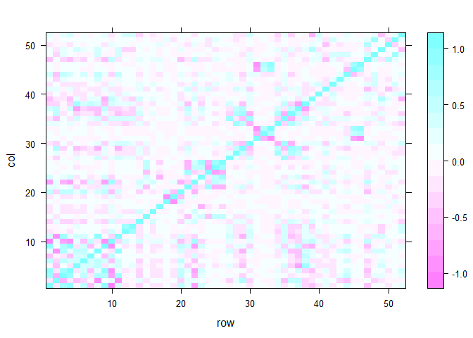
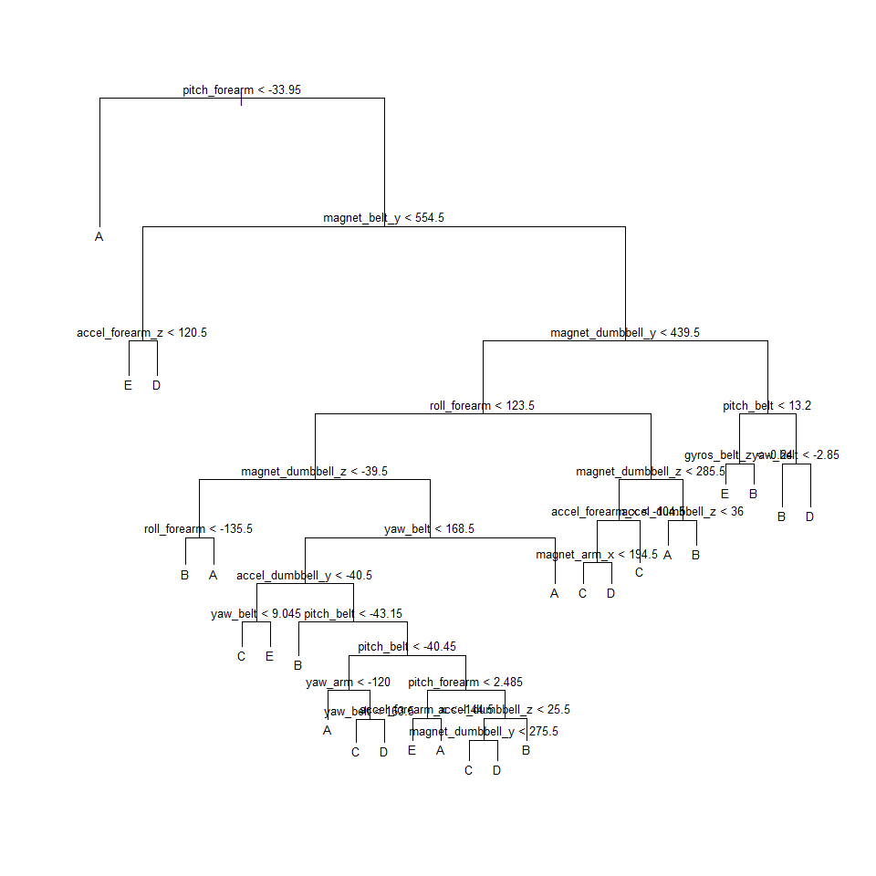
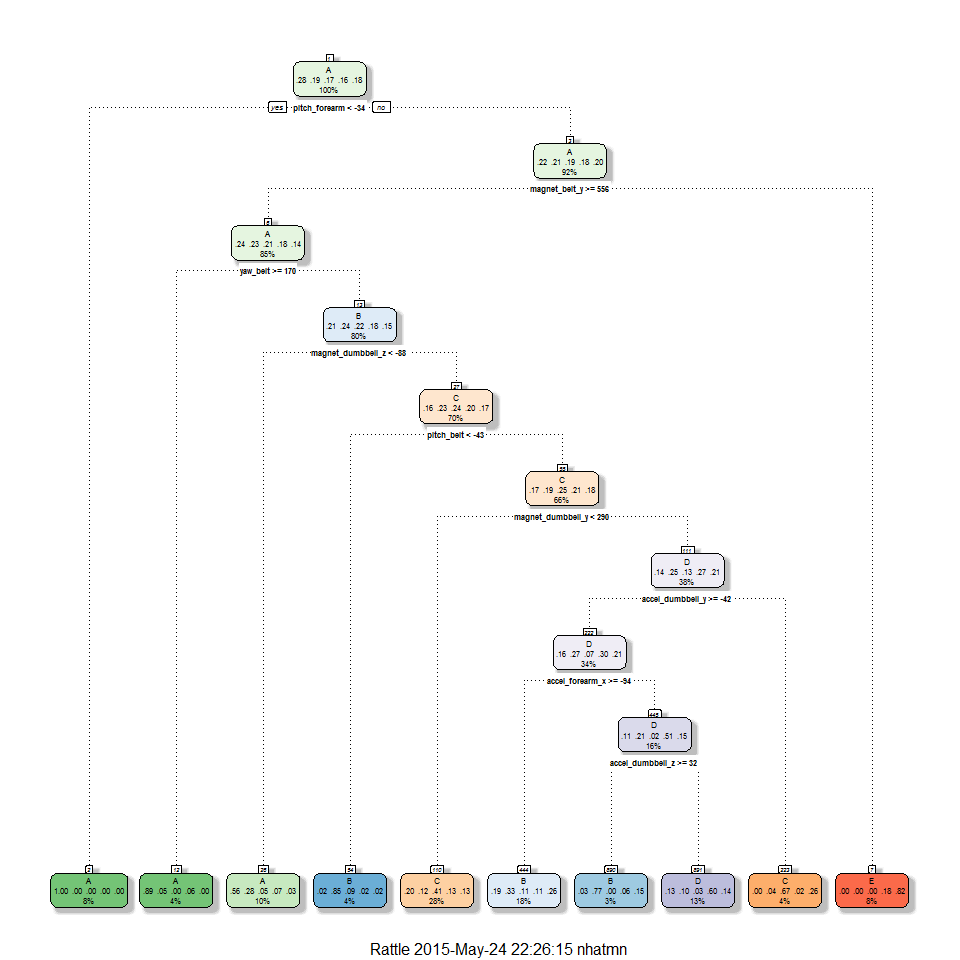
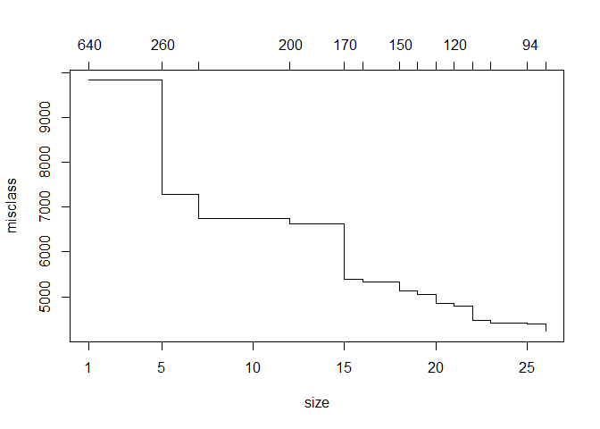
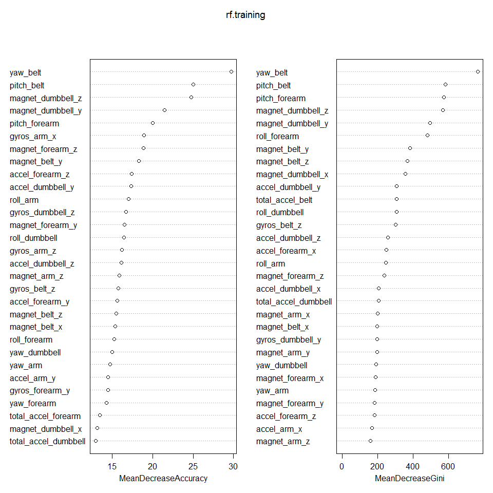

# Prediction Assignment Writeup - Practical Machine Learning
nhatmn  
Sunday, May 24, 2015  

# Data 

The training data for this project are available here: 
https://d396qusza40orc.cloudfront.net/predmachlearn/pml-training.csv
The test data are available here: 
https://d396qusza40orc.cloudfront.net/predmachlearn/pml-testing.csv
The data for this project come from this source: http://groupware.les.inf.puc-rio.br/har. 

# Load Load neccessary library

```r
library("caret")
library("tree")
library("rattle")
library("randomForest")
library("rpart")
library("rpart.plot")
```

# Read data from "pml-training.csv" and "pml-testing.csv".

```r
# Load data
trainingOrg = read.csv("pml-training.csv", na.strings=c("", "NA", "NULL"))
testingOrg = read.csv("pml-testing.csv", na.strings=c("", "NA", "NULL"))

# Now see dimension of "pml-training.csv" and "pml-testing.csv".
dim(trainingOrg)
```

```
## [1] 19622   160
```

```r
dim(testingOrg)
```

```
## [1]  20 160
```

# Remove variables that have too many NA values

```r
training.dena <- trainingOrg[ , colSums(is.na(trainingOrg)) == 0]
# Now see dimension of training.dena
dim(training.dena)
```

```
## [1] 19622    60
```

```r
# Remove unrelevant variables.
remove = c('X', 'user_name', 'raw_timestamp_part_1', 'raw_timestamp_part_2', 'cvtd_timestamp', 'new_window', 'num_window')
training.dere <- training.dena[, -which(names(training.dena) %in% remove)]
dim(training.dere)
```

```
## [1] 19622    53
```

```r
# Check the variables that have extremely low variance
zeroVar= nearZeroVar(training.dere[sapply(training.dere, is.numeric)], saveMetrics = TRUE)
training.nonzerovar = training.dere[, zeroVar[, 'nzv']==0]
dim(training.nonzerovar)
```

```
## [1] 19622    53
```

```r
# Remove highly correlated variables 90%
corrMatrix <- cor(na.omit(training.nonzerovar[sapply(training.nonzerovar, is.numeric)]))
dim(corrMatrix)
```

```
## [1] 52 52
```

```r
corrDF <- expand.grid(row = 1:52, col = 1:52)
corrDF$correlation <- as.vector(corrMatrix)
```

```r
levelplot(correlation ~ row+ col, corrDF)
```

 

```r
# Remove high correlation variables.
removecor = findCorrelation(corrMatrix, cutoff = .90, verbose = TRUE)
```

```r
training.decor = training.nonzerovar[, -removecor]
dim(training.decor)
```

```
## [1] 19622    46
```

# Split data to training and testing for cross validation.

```r
inTrain <- createDataPartition(y=training.decor$classe, p=0.7, list=FALSE)
training <- training.decor[inTrain,]; testing <- training.decor[-inTrain,]
dim(training)
```

```
## [1] 13737    46
```

```r
dim(testing)
```

```
## [1] 5885   46
```

# Fit a tree to these data, and summarize and plot it

```r
set.seed(2125) #Birthday date of me and my girlfriend :)
tree.training=tree(classe~., data=training)
summary(tree.training)
```

```
## 
## Classification tree:
## tree(formula = classe ~ ., data = training)
## Variables actually used in tree construction:
##  [1] "pitch_forearm"     "magnet_belt_y"     "accel_forearm_z"  
##  [4] "magnet_dumbbell_y" "roll_forearm"      "magnet_dumbbell_z"
##  [7] "yaw_belt"          "accel_dumbbell_y"  "pitch_belt"       
## [10] "yaw_arm"           "accel_forearm_x"   "accel_dumbbell_z" 
## [13] "magnet_arm_x"      "gyros_belt_z"     
## Number of terminal nodes:  26 
## Residual mean deviance:  1.429 = 19590 / 13710 
## Misclassification error rate: 0.272 = 3737 / 13737
```

```r
plot(tree.training)
text(tree.training, pretty=0, cex =.8)
```

 

# Running rpart for the form Caret

```r
modFit <- train(classe ~ ., method="rpart", data=training)
print(modFit$finalModel)
```

```
## n= 13737 
## 
## node), split, n, loss, yval, (yprob)
##       * denotes terminal node
## 
##   1) root 13737 9831 A (0.28 0.19 0.17 0.16 0.18)  
##     2) pitch_forearm< -33.95 1077    4 A (1 0.0037 0 0 0) *
##     3) pitch_forearm>=-33.95 12660 9827 A (0.22 0.21 0.19 0.18 0.2)  
##       6) magnet_belt_y>=555.5 11626 8795 A (0.24 0.23 0.21 0.18 0.14)  
##        12) yaw_belt>=169.5 574   63 A (0.89 0.047 0 0.063 0) *
##        13) yaw_belt< 169.5 11052 8428 B (0.21 0.24 0.22 0.18 0.15)  
##          26) magnet_dumbbell_z< -87.5 1430  631 A (0.56 0.28 0.051 0.072 0.034) *
##          27) magnet_dumbbell_z>=-87.5 9622 7301 C (0.16 0.23 0.24 0.2 0.17)  
##            54) pitch_belt< -42.95 563   84 B (0.02 0.85 0.087 0.025 0.018) *
##            55) pitch_belt>=-42.95 9059 6787 C (0.17 0.19 0.25 0.21 0.18)  
##             110) magnet_dumbbell_y< 290.5 3850 2269 C (0.2 0.12 0.41 0.13 0.13) *
##             111) magnet_dumbbell_y>=290.5 5209 3796 D (0.14 0.25 0.13 0.27 0.21)  
##               222) accel_dumbbell_y>=-42 4650 3250 D (0.16 0.27 0.068 0.3 0.21)  
##                 444) accel_forearm_x>=-93.5 2449 1646 B (0.19 0.33 0.11 0.11 0.26) *
##                 445) accel_forearm_x< -93.5 2201 1075 D (0.11 0.21 0.025 0.51 0.15)  
##                   890) accel_dumbbell_z>=32.5 366   86 B (0.03 0.77 0 0.057 0.15) *
##                   891) accel_dumbbell_z< 32.5 1835  730 D (0.13 0.095 0.029 0.6 0.14) *
##               223) accel_dumbbell_y< -42 559  183 C (0 0.041 0.67 0.023 0.26) *
##       7) magnet_belt_y< 555.5 1034  188 E (0.0019 0.0029 0.0019 0.18 0.82) *
```

# Prettier plots

```r
fancyRpartPlot(modFit$finalModel)
```

 
The result from 'caret' 'rpart' is close to 'tree'.

# Check the performance of the tree on the testing data by cross validation.

```r
tree.pred=predict(tree.training, testing,type="class")
predMatrix = with(testing, table(tree.pred, classe))
sum(diag(predMatrix))/sum(as.vector(predMatrix))
```

```
## [1] 0.7233645
```

```r
tree.pred=predict(modFit, testing)
predMatrix = with(testing,table(tree.pred, classe))
sum(diag(predMatrix))/sum(as.vector(predMatrix))
```

```
## [1] 0.5767205
```
The result from 'caret' is much lower than the result from 'tree'.

# Use Cross Validation to prune the tree

```r
cv.training=cv.tree(tree.training, FUN=prune.misclass)
cv.training
```

```
## $size
##  [1] 26 25 23 22 21 20 19 18 16 15 12  7  5  1
## 
## $dev
##  [1] 4226 4394 4419 4478 4799 4853 5059 5138 5335 5399 6623 6739 7293 9831
## 
## $k
##  [1]     -Inf  94.0000  98.0000 104.0000 123.0000 127.0000 139.0000
##  [8] 146.0000 155.0000 167.0000 195.3333 201.4000 265.0000 641.2500
## 
## $method
## [1] "misclass"
## 
## attr(,"class")
## [1] "prune"         "tree.sequence"
```

```r
plot(cv.training)
```

 
Suppose that the size of nodes is 19

```r
# Suppose that the size of nodes is 19
prune.training=prune.misclass(tree.training, best=19)
# Evaluate this pruned tree on the test data
tree.pred=predict(prune.training, testing, type="class")
predMatrix = with(testing, table(tree.pred,classe))
sum(diag(predMatrix))/sum(as.vector(predMatrix))
```

```
## [1] 0.673407
```
The single tree is not good enough, so we are going to use bootstrap to improve the accuracy. We are going to try random forests.

# Random Forests

```r
set.seed(2125) #Birthday date of me and my girlfriend :)
rf.training=randomForest(classe~., data=training, ntree=100, importance=TRUE)
rf.training
```

```
## 
## Call:
##  randomForest(formula = classe ~ ., data = training, ntree = 100,      importance = TRUE) 
##                Type of random forest: classification
##                      Number of trees: 100
## No. of variables tried at each split: 6
## 
##         OOB estimate of  error rate: 0.6%
## Confusion matrix:
##      A    B    C    D    E  class.error
## A 3903    2    0    0    1 0.0007680492
## B   19 2626   12    0    1 0.0120391272
## C    0   17 2376    3    0 0.0083472454
## D    0    0   21 2229    2 0.0102131439
## E    0    0    2    2 2521 0.0015841584
```

```r
varImpPlot(rf.training,)
```

 

# Evaluate this tree on the test data.
Our Random Forest model shows OOB estimate of error rate: 0.72% for the training data. Now we will predict it for out-of sample accuracy.

```r
tree.pred=predict(rf.training, testing, type="class")
predMatrix = with(testing, table(tree.pred,classe))
sum(diag(predMatrix))/sum(as.vector(predMatrix))
```

```
## [1] 0.9957519
```

# Conclusion: Predict the testing data from the website

```r
answers <- predict(rf.training, testingOrg)
# See answers
answers
```

```
##  1  2  3  4  5  6  7  8  9 10 11 12 13 14 15 16 17 18 19 20 
##  B  A  B  A  A  E  D  B  A  A  B  C  B  A  E  E  A  B  B  B 
## Levels: A B C D E
```
Then print the result to files.

```r
# Function to write "answers" vector to files
pml_write_files = function(x){
    n = length(x)
    for(i in 1:n){
        filename = paste0("problem_id_", i ,".txt")
        write.table(x[i], file = filename, quote = FALSE, row.names = FALSE, col.names = FALSE)
    }
}
# Call the function to write "answers" vector to files
pml_write_files(answers)
```

